# Gustavo Mota

### Desenvolvedor Full Stack

Desenvolvo sistemas ponta a ponta — da modelagem de dados à interface — com foco em qualidade, manutenibilidade e resultado prático.

---

### 🧭 Sobre

- Trabalho no ciclo completo de desenvolvimento: modelagem de banco de dados, back-end, front-end e deploy.
- Já apliquei essas habilidades em diferentes contextos — de sistemas acadêmicos a ferramentas usadas por negócios reais.
- Tenho interesse particular em arquitetura de software bem estruturada e em processos de desenvolvimento assistidos por IA, sempre com revisão e validação humana em cada etapa.
- Este perfil reflete um trabalho em constante evolução — os projetos e tecnologias abaixo são atualizados conforme meu aprendizado avança.

---

### 🛠️ Tecnologias

---

### 📌 Projetos em destaque

<table>
  <tr>
    <td width="50%" valign="top">
      <h4>🌶️ <a href="https://github.com/gustavomot4/SPO_inventory_management">SPO — Sistema de Gestão de Estoque e Vendas</a></h4>
      
Sistema completo para controle de estoque, PDV com múltiplas formas de pagamento, relatórios e autenticação — empacotado com Docker para deploy simplificado.

      

        
        
        
      

    </td>
    <td width="50%" valign="top">
      <h4>📚 <a href="https://github.com/gustavomot4/A3---Library-Management-System">Library Management System</a></h4>
      
Sistema de gestão de biblioteca com CRUD completo de usuários e livros, banco de dados relacional e persistência via JDBC.

      

        
        
      

    </td>
  </tr>
  <tr>
    <td width="50%" valign="top">
      <h4>🖇️ <a href="https://github.com/gustavomot4/file-renamer">File Renamer</a></h4>
      
Aplicação desktop para renomeação em lote de arquivos, com interface gráfica e processamento automatizado.

      

        
        
      

    </td>
    <td width="50%" valign="top">
      <h4>🌐 <a href="https://github.com/gustavomot4/TAP-GO">TAP-GO</a></h4>
      
Aplicação web com arquitetura CRUD completa (rotas, controllers e models), usada como referência de projeto full stack.

      

        
        
      

    </td>
  </tr>
</table>

  <a href="https://github.com/gustavomot4?tab=repositories">Ver todos os repositórios →</a>

---

### 📊 Estatísticas

---

### 📫 Contato

